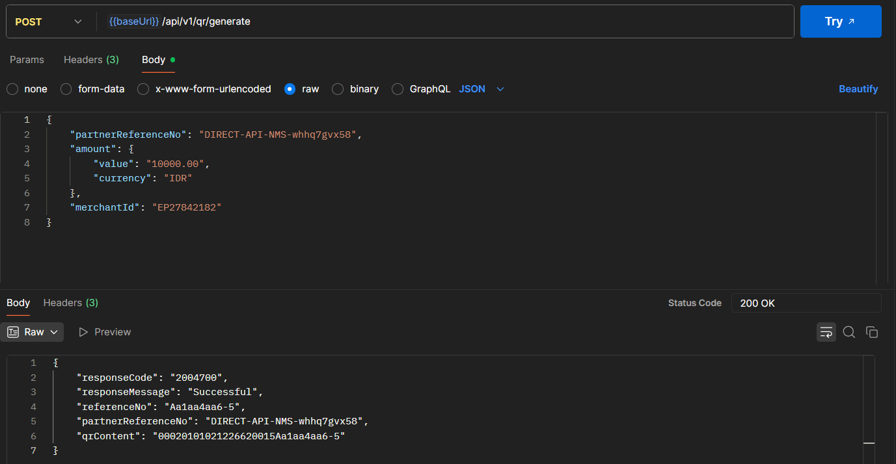
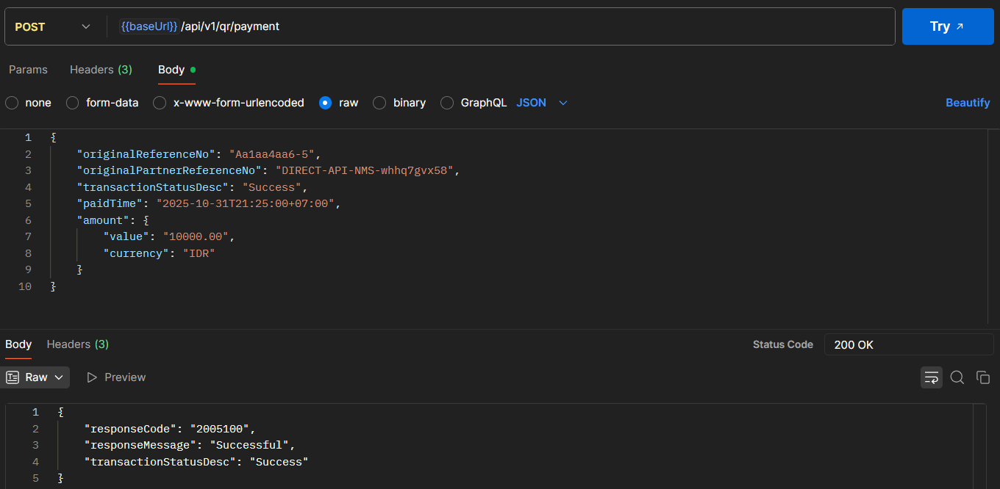
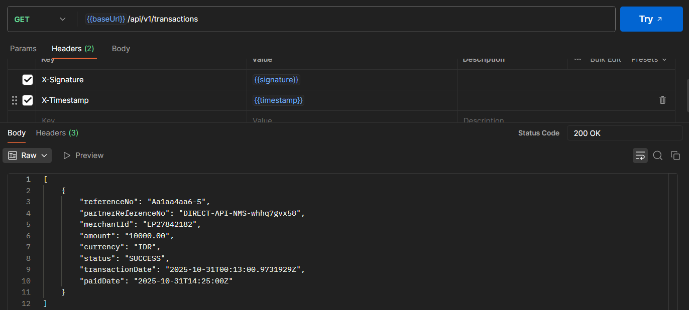
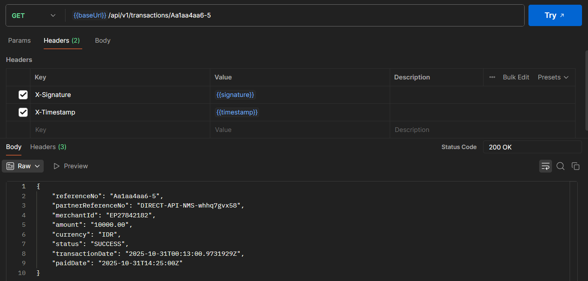

# Payment Backend Service (Golang)

Backend ini merupakan layanan pembayaran sederhana yang mensimulasikan sistem transaksi merchant seperti e-wallet, lengkap dengan QR generation, callback payment, dan tracking transaksi merchant.

Dibangun menggunakan **Golang (Chi Router)** dengan **Clean Architecture** dan penyimpanan **SQLite** agar mudah di-deploy secara lokal tanpa setup database tambahan.

---

## Fitur Utama

- Generate QR untuk transaksi baru  
- Callback pembayaran (update status transaksi)  
- Melihat daftar transaksi merchant  
- Melihat detail transaksi per `referenceNo`  
- Menggunakan middleware Signature (HMAC-SHA256)  
- Validasi input dengan `go-playground/validator`  
- CORS support untuk frontend React  

---

## Cara Menjalankan

### Clone repo
```bash
git clone https://github.com/<username>/payment_backend.git
cd payment_backend
```

### Install dependency
```bash
go mod tidy
```

### Jalankan server
```bash
go run ./cmd/server
```

Server akan berjalan di http://localhost:8080

## Dokumentasi
- /api/v1/qr/generate


- /api/v1/qr/payment


- /api/v1/transactions


- /api/v1/transactions/referenceNo
